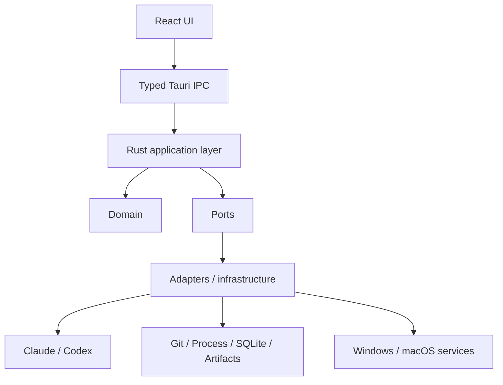
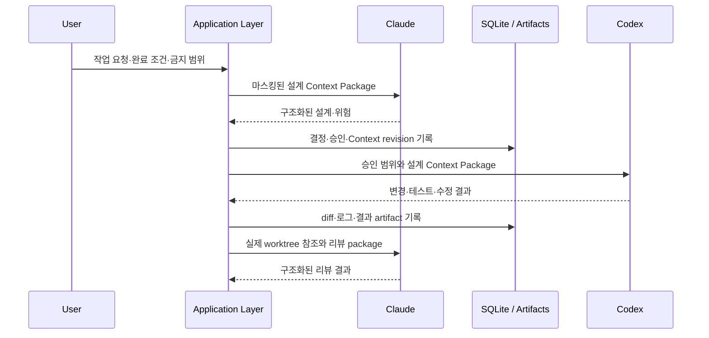

# ChatOMS 아키텍처

## 시스템 개요

ChatOMS는 별도 웹 서버 없이 한 장비에서 실행되는 Tauri 데스크톱 애플리케이션이다. UI는 시스템 자원을 직접 조작하지 않고, 모든 작업을 타입이 정의된 Tauri IPC를 통해 Rust application layer에 요청한다.

### Runtime 호출 흐름

아래 화살표는 실행 중 호출 방향을 나타낸다.



## 계층과 책임

### React UI

- 시스템 상태, 프로젝트, 작업 진행, 승인, 결과와 복구 정보를 표시한다.
- Git, CLI, SQLite, 파일 시스템 또는 네트워크를 직접 호출하지 않는다.
- Rust application service가 노출한 Tauri command를 호출하고 event stream을 구독한다.
- Phase 1 UI는 앱 셸, 기본 라우팅, 시스템 상태, 프로젝트 빈 화면과 공통 오류 표시에 한정한다.

### Tauri IPC

- 프런트엔드 DTO와 Rust application request/response 사이의 경계다.
- 입력을 검증하고 내부 오류를 안전한 사용자 오류로 변환한다.
- 내부 경로, 원문 프로세스 오류 또는 비밀정보를 UI에 그대로 전달하지 않는다.

### Rust application layer

- 프로젝트 등록, 작업 시작, 승인, 하네스 진행, 복구와 정리 유스케이스를 조정한다.
- 전체 앱의 단일 `ActiveTaskLease`와 작업별 단일 branch·최대 단일 worktree 불변조건을 트랜잭션으로 관리한다.
- domain port만 사용하며 구체적인 CLI, Git, SQLite와 OS 구현을 직접 포함하지 않는다.

### Domain core

- 프로젝트, 프로필, 작업, 상태 전이, 승인, Context Package와 artifact 참조를 모델링한다.
- Tauri, React, SQLite, Git 명령 및 Claude/Codex 프로토콜에 의존하지 않는다.
- 상태 전이는 [작업 상태 머신](STATE_MACHINE.md)에 정의된 도메인 유스케이스로만 수행한다.

### Ports, adapters, infrastructure

- Ports는 공급자, Git, 프로세스, 저장소, 플랫폼과 업데이트 기능의 계약을 정의한다.
- Adapters는 Claude CLI, Codex app-server, Git/worktree와 구조화 프로세스 실행을 구현한다.
- Infrastructure는 SQLite repository, artifact 저장소, 로깅, 마스킹과 OS별 서비스를 구현한다.
- Phase 1~6의 UpdateService는 추상화만 존재하며 실제 배포 채널과 설치 동작은 Phase 7 전 결정한다.

| Port | 책임 | Adapter / infrastructure 경계 |
|---|---|---|
| `ProviderService` | 공급자 실행, event 변환, capability 검증 | Claude CLI adapter, Codex app-server adapter |
| `GitService` | 저장소 조회, task branch/worktree 생명주기, commit·merge | Git/worktree adapter |
| `ProcessRunner` | 프로그램과 인수 배열 기반 실행, 출력·종료 제어 | OS별 structured process adapter |
| `ArtifactRepository` | 마스킹된 로그, diff, 결과와 첨부파일 저장·조회 | 로컬 artifact infrastructure |
| `FilePermissionService` | 앱 데이터 경로의 사용자 전용 권한 적용·검증 | Windows/macOS platform adapter |
| `UpdateService` | 업데이트 상태와 향후 업데이트 동작의 계약 | Phase 1~6에는 port만 정의하고 구현은 Phase 7 결정 이후 추가 |

## 컴파일 의존 방향

아래 화살표는 런타임 호출이 아니라 소스 코드의 compile-time 의존을 나타낸다. Adapter와 infrastructure가 application layer에 정의된 port를 구현한다.

```text
React UI
  → Tauri IPC
    → application layer
      → domain
      → ports

adapters / infrastructure
  → ports
  → domain types (필요한 경우에만)
```

- 바깥 계층은 안쪽 계층을 의존할 수 있지만 domain core는 바깥 계층을 의존하지 않는다.
- 공급자 고유 메시지는 adapter 내부에서 공통 provider event로 변환한다.
- OS 조건문은 platform adapter에 한정하고 상위 유스케이스로 확산하지 않는다.
- model recommendation은 application layer의 정책 service가 담당하고 UI나 provider adapter가 임의로 결정하지 않는다.
- Gajae-Code에서 참고한 workflow 개념은 외부 adapter가 아니라 내부 Harness Orchestrator/Workflow Engine이 소유한다. 외부 Gajae-Code 저장소나 protocol에는 의존하지 않는다.

## Claude와 Codex의 역할

### Claude

- 요구사항 분석, 설계, 위험 식별과 최종 리뷰를 담당한다.
- 설계 실행은 최대 12 turns, 리뷰 실행은 최대 8 turns로 제한한다.
- 공통 기본 계약은 `--permission-mode plan`, `Read`·`Glob`·`Grep`만 허용, `Edit`·`Write`·`NotebookEdit`·`Bash`·web·MCP 도구 차단, stream-json 출력과 최종 JSON Schema 검증이다.
- Phase 3에서 설치된 Claude CLI 버전이 필요한 flag, tool 제한, 구조화 출력과 turn 상한을 지원하는지 런타임 검증한다.
- 필수 정책이 지원되지 않으면 권한을 완화하거나 비구조화 출력으로 전환하지 않고 실행을 차단한다.
- Claude는 코드를 직접 수정하지 않는다.

### Codex

- 구현, 리팩터링, 테스트 작성·실행과 승인된 수정 작업을 담당한다.
- `codex app-server`의 stdio JSONL 프로토콜을 주 제어 방식으로 사용한다.
- 설치된 Codex에서 JSON Schema 또는 TypeScript schema를 생성한 뒤 프로토콜과 필수 capability를 검증한다.
- 호환성 검증이 실패해도 `codex exec`로 자동 전환하지 않는다.

## Context Package 흐름

전체 모델 대화를 그대로 전달하지 않고 작업별 Context Package를 사용한다.



- Package에는 작업 ID, 프로젝트/worktree, 기준 commit, 요구사항, 완료 조건, 결정, 금지 범위, 관련 파일, 테스트 결과, 수정 이력과 미해결 위험을 포함한다.
- 저장 및 공급자 전송 전에 민감정보를 마스킹한다.
- 각 모델은 Context Package만 신뢰하지 않고 허용된 범위에서 동일 worktree의 실제 파일을 확인한다.
- 공급자 전송은 [보안 정책](SECURITY_POLICY.md)의 작업별 1회 동의를 따른다.

## 저장소 역할

### SQLite

- 프로젝트, 프로필 참조, 작업, 현재 상태와 상태 전이 이력을 저장한다.
- 실행·승인·모델 선택·병합·복구 메타데이터와 artifact 참조를 저장한다.
- DB의 foreign key·unique·check 제약은 단일 `ActiveTaskLease`와 관계 cardinality 같은 영속 불변조건을 방어하고, domain은 상태 전이와 업무 의미를 검증한다.
- 모든 production file connection은 중앙 initializer에서 `foreign_keys=ON`, `journal_mode=WAL`, `synchronous=FULL`, `busy_timeout=5000`을 적용한 뒤 값을 다시 읽어 검증한다. `foreign_keys=OFF` raw connection은 schema가 방어할 수 없는 신뢰 경계 밖이다.
- migration은 application에 포함된 forward-only SQL과 원문 byte 기준 SHA-256 registry를 사용한다. 각 migration은 독립 transaction에서 SQL, `foreign_key_check`, metadata 기록을 함께 commit하며 실패한 현재 migration만 rollback한다.
- migration trigger는 immutable column과 불법 lease 직접 조작 방어에만 사용한다. Task·transition·lease lifecycle과 transition sequence 증가는 자동화하지 않으며 repository가 명시적인 transaction과 마지막 sequence 검증을 소유한다.
- Task 생성은 Task, 최초 `Created` transition과 lease를 하나의 `IMMEDIATE` transaction으로 기록한다. 종료 전이는 Task 갱신, transition 기록과 lease 삭제를 하나의 transaction으로 처리한다.
- 일반·contextual·post-terminal 전이는 expected version을 SQL `WHERE` 조건으로 검증하고, repository가 transition sequence 연속성과 DB 현재 상태 대비 aggregate 문맥을 재검증한다.
- Repository는 active lease를 자동 탈취·교체하거나 retry하지 않는다. 충돌은 typed error로 반환하며 recovery 정책은 후속 application use case가 결정한다.
- 읽기 경로는 UUID, 상태, branch identity, resume/terminal 불변조건과 transition history를 검증한 뒤 domain aggregate로 복원한다.

### Artifact 저장소

- 전체 로그, stdout/stderr, diff, 테스트·빌드 결과, 리뷰, 실패 보고서, 체크포인트와 첨부파일을 저장한다.
- 데이터는 Git 추적, 공유 폴더와 클라우드 동기화 폴더 밖의 앱 데이터 경로에 둔다.
- 원문을 영구 저장하기 전에 [보안 정책](SECURITY_POLICY.md)에 따라 마스킹한다.

## 플랫폼 추상화

Windows Native와 macOS 구현은 다음과 같은 port 뒤에 분리한다.

- `PlatformService`
- `PathResolver`
- `FilePermissionService`
- `ProcessRunner`
- `NotificationService`
- `DiskEncryptionStatusService`
- `UpdateService`

Windows를 우선 구현하며 WSL은 MVP 지원 범위에서 제외한다.

### 안전한 앱 데이터 경로

- `AppPathResolver` port는 경로 계산과 layout 검증만 담당하고, `FilesystemPermissionManager` port는 ACL 적용과 재검증만 담당한다.
- Windows 구현은 `%LOCALAPPDATA%\ChatOMS` 아래에 `data`, `logs`, `artifacts`, `temp`를 분리하며 DB는 `data\chatoms.sqlite3`에 둔다.
- `SecureAppPaths`는 절대 local layout 확인, reparse point 거부, directory 생성, 권한 적용과 재검증 순서로 준비하며 `Secure`가 아닌 결과에는 validated path를 반환하지 않는다.
- Application layer는 `SecureAppPaths`가 반환한 경로만 영구 SQLite, log와 artifact 저장에 사용한다.
- macOS는 Phase 1에서 동일 port의 compile 구조와 `Unsupported` permission 결과만 제공하며 실제 경로·권한 검증은 macOS 환경에서 후속 수행한다.

## 오류 분류와 안전한 진단 경계

- `chatoms-ports`는 adapter 구현을 모르는 `FailureCategory`, `FailureSeverity`, `RetryDisposition`과 `CategorizedFailure` 계약을 소유한다.
- Infrastructure와 platform의 concrete error는 SQLite, OS, I/O 및 tracing source chain을 내부 진단용으로 유지하되 ports category로만 분류한다.
- Application은 domain error 또는 ports category만 stable `ApplicationError` code와 사용자 안전 메시지로 변환한다. `chatoms-infrastructure`와 `chatoms-platform`에 의존하지 않는다.
- 비신뢰 문자열은 infrastructure의 `SecretRedactor`를 거쳐 `RedactedText`가 된 후에만 영구 로그 경계로 전달한다.
- Production logging은 `SecureAppPaths` 결과와 `PermissionStatus::Secure`로 만든 validated logs directory만 받고, ANSI 없는 structured JSON을 non-blocking daily rolling file로 기록한다.
- 이 계약은 application의 stable `ApplicationError` mapping, Tauri IPC의 safe `IpcErrorDto`, frontend의 `FrontendError` safe field 표시까지 연결됐다. Read-only IPC와 `/system`, `/projects` UI가 구현됐으며 source, path, SID, SQL과 secret은 사용자 오류에 노출하지 않는다.

## Phase 1 application service

- Application은 `BootstrapService`, `SystemService`, `ProjectService`, `TaskService`로 분리하며 각 서비스는 필요한 port만 빌려 사용한다. Global singleton이나 concrete adapter service locator는 두지 않는다.
- Bootstrap 순서는 secure storage 준비 → database bootstrap → logging bootstrap → active lease 조회다. Storage가 secure하지 않으면 뒤 단계를 호출하지 않고, database가 ready/upgraded가 아니면 logging과 lease 조회를 호출하지 않는다.
- Logging unavailable은 raw fallback 없이 degraded 상태로 처리한다. Secure storage와 database가 준비됐다면 application bootstrap 자체는 ready이며 system health는 `Degraded`다.
- System/project/task 결과는 Tauri 및 serde와 독립적인 application read model이다. IPC DTO는 Tauri 계층에서 별도로 정의하며 `ProjectDto`와 frontend에는 root path를 노출하지 않는다.
- Task 생성 시 application이 UUIDv7 Task ID와 branch identity, 최초 `Created` transition을 구성하고 repository의 원자적 create boundary를 호출한다. 이후 sequence 값은 repository port가 history를 캡슐화해 제공하고 concrete repository가 transaction 안에서 재검증한다.
- 정적 전이, pause 진입, `RecoveryRequired` 진입과 terminal 전이는 domain aggregate를 거쳐 repository transaction port로 저장한다. Resume/recovery target 확정은 실제 validation capability가 없으므로 Phase 1 현재 API에서 `Unsupported`로 보류하며 validation token을 임의 생성하지 않는다.
- 시간은 `TimeProvider` port로 주입하며 production에서는 검증된 Unix epoch milliseconds를 반환하는 `SystemTimeProvider`를 Tauri composition root가 연결한다.

## Phase 1 production adapter와 Tauri IPC

- Tauri composition root가 platform storage·time·capability adapter와 infrastructure database·logging·repository adapter를 구성하고 `BootstrapService`에 주입한다. Application service는 concrete adapter를 알지 못한다.
- Production startup은 한 번만 수행한다. Secure path, 단일 SQLite connection owner와 non-blocking logging guard는 managed runtime이 공유 소유하고, command마다 bootstrap이나 connection open을 반복하지 않는다.
- SQLite connection은 `SharedDatabase`의 `Mutex` 안에 보관하고 repository adapter만 접근한다. Global mutable state나 unsafe `Send`/`Sync` 구현은 사용하지 않는다.
- Managed runtime은 `Ready(AppRuntime)`와 `Unavailable`을 구분한다. Secure storage·database 실패는 unavailable이며 logging 실패는 raw fallback 없이 degraded ready다. Unavailable에서도 version과 health만 안전하게 조회할 수 있다.
- Tauri command는 managed state 획득, application service 호출, application read model의 IPC DTO 변환, safe IPC error 변환만 수행한다. SQL, filesystem, ACL, migration 또는 process를 직접 호출하지 않는다.
- IPC DTO는 camelCase와 안정적인 enum 문자열을 사용한다. UUID는 lowercase canonical 문자열, timestamp는 Unix epoch milliseconds이며 `ProjectDto`에는 전체 root path를 포함하지 않는다.
- Phase 1 handler는 `get_version`, `get_health`, `get_system_status`, `get_bootstrap_status`, `list_projects`, `get_active_task`, `get_task`, `list_task_history`만 등록한다. Create·transition·Git·provider·updater·installer command는 공개하지 않는다.

## Phase 1 frontend

- React page는 Tauri `invoke`를 직접 호출하지 않는다. 중앙 typed IPC client가 승인된 command 문자열, camelCase payload, response guard와 safe frontend error 변환을 소유한다.
- Frontend type은 Rust IPC DTO의 camelCase 필드와 안정적 enum 문자열을 그대로 반영한다. Transport 결과는 `unknown`으로 받고 DTO별 runtime guard를 통과한 값만 page state에 전달한다.
- `/system`은 system·bootstrap status를 중심으로 version, health, storage, database, logging, active lease와 Phase 1 capability를 read-only로 표시한다. 핵심 호출 실패는 safe error state, 보조 호출 실패는 기존 application status를 변경하지 않는 partial notice로 처리한다.
- `/projects`는 project name, canonical ID와 timestamp만 표시하며 root path를 frontend type과 render tree에 포함하지 않는다. 등록·수정·삭제 또는 task 생성 action은 제공하지 않는다.
- Router와 page는 React local state만 사용한다. 별도 state manager, query cache, UI library 또는 CSS framework를 추가하지 않는다.
- 공통 loading, empty, error와 status badge는 semantic role, 텍스트 label, visible focus와 retry disposition을 적용하며 raw invoke error, source, path, SQL, SID, stack 또는 secret을 표시하지 않는다.
